# Escalabilidad, Alta Disponibilidad y Observabilidad en AWS

## Escalabilidad horizontal

1. Security Groups

Se crearon sg-alb-scalability (HTTP 80 desde 0.0.0.0/0) y sg-ec2-scalability (HTTP 80 únicamente desde sg-alb-scalability).

2. Instancia base y verificación

Se lanzó la instancia web-scalability-base con Amazon Linux 2023, Apache instalado vía User Data, y se validó que 
respondiera correctamente en / y /health.

3. Creación de la AMI

Se generó la imagen ami-web-scalability-arsw a partir de la instancia base, ya validada.

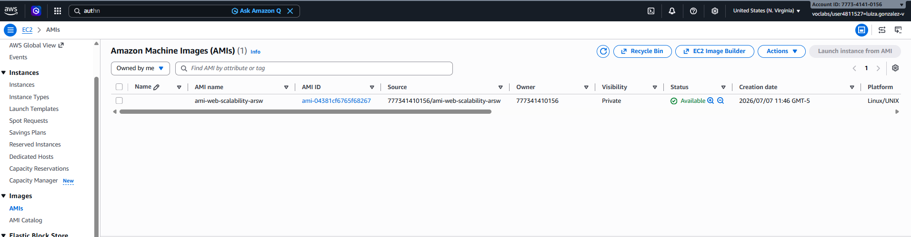

4. Launch Template

Se creó el Launch Template lt-web-scalability a partir de la AMI anterior, sin User Data adicional.

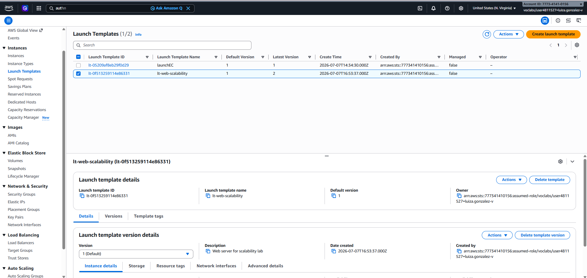

## Alta disponibilidad con Load Balancer

1. Target Group

Se creó tg-scalability-ha, protocolo HTTP puerto 80, con health check en la ruta /health.

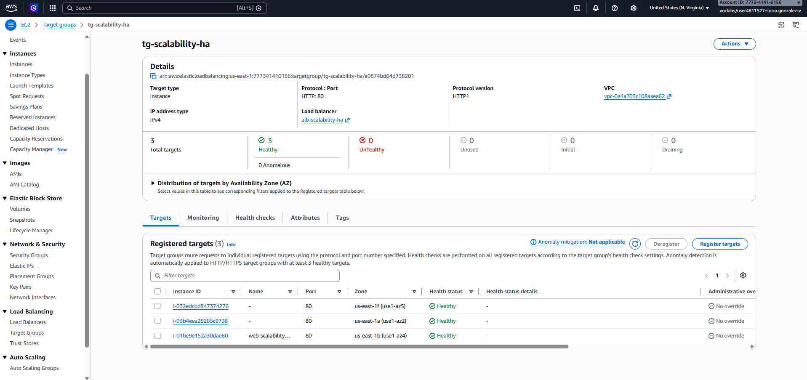

2. Application Load Balancer

Se creó alb-scalability-ha, internet-facing, en dos zonas de disponibilidad, 
con listener HTTP:80 apuntando al Target Group.

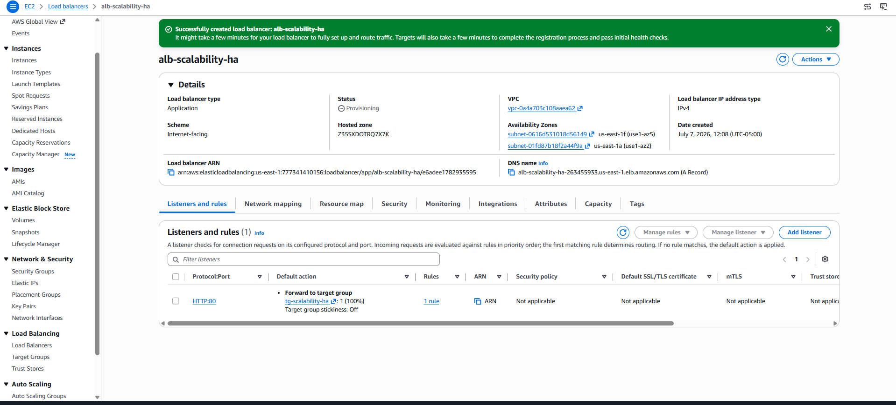

3. Auto Scaling Group

Se creó asg-web-scalability a partir del Launch Template, asociado al Target Group, con capacidad mínima 2, máxima 3, 
y política de target tracking sobre CPU (objetivo 50%).

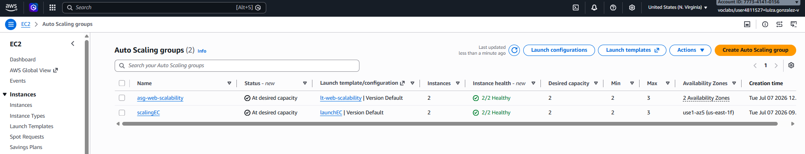

4. Verificación de instancias creadas por Auto Scaling

El Auto Scaling Group registró automáticamente las instancias nuevas.

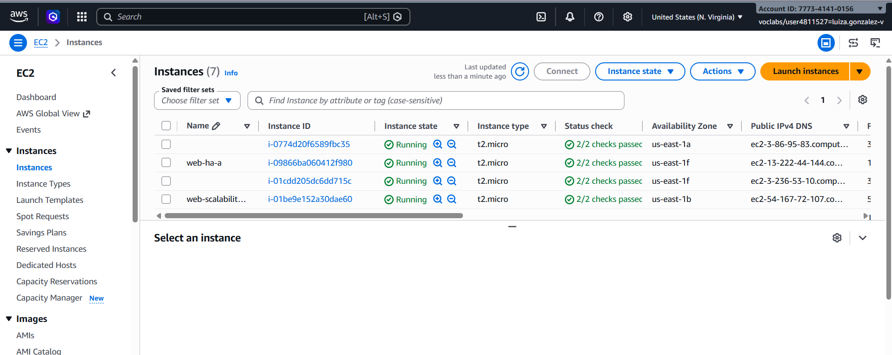

5. Verificación del Target Group

Las instancias quedaron en estado Healthy antes de recibir tráfico del ALB.

6. Prueba del Load Balancer

Solicitudes repetidas al DNS del balanceador, mostrando respuestas desde distintos Instance ID.

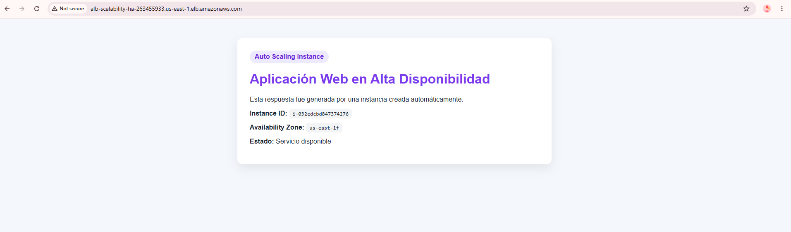
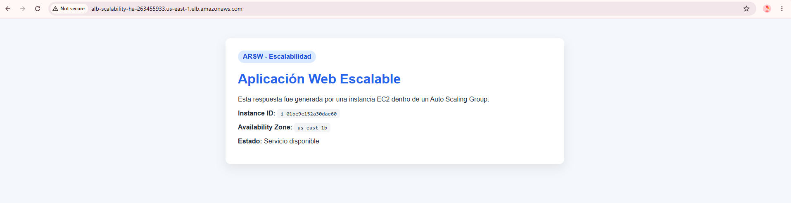

## Actividad 1: análisis de escalabilidad y alta disponibilidad

* ¿Qué componente distribuye el tráfico?

El Application Load Balancer (alb-scalability-ha) recibe todas las solicitudes por un único DNS
y las reparte entre las instancias registradas en el Target Group.

* ¿Qué componente decide cuántas instancias deben existir?

El Auto Scaling Group, con base en su capacidad deseada y en la política de target tracking sobre CPU.

* ¿Qué componente verifica la salud de las instancias?

El Target Group, mediante el health check configurado en la ruta /health.

* ¿Por qué se seleccionan dos zonas de disponibilidad?

Para que, si una zona completa falla, las instancias de la otra zona sigan respondiendo y el servicio
no se caiga por completo.

* ¿Qué diferencia existe entre Target Group y Auto Scaling Group?

El Target Group es una lista de destinos a los que el balanceador puede enviar tráfico,
junto con la lógica de health checks para saber cuáles están sanos. El Auto Scaling Group
decide cuántas instancias deben existir, las crea o elimina, y las registra/desregistra 
automáticamente en el Target Group.

* ¿Qué pasaría si una instancia falla?

El health check la marca como Unhealthy, el balanceador deja de enviarle tráfico,
y el Auto Scaling Group la reemplaza por una nueva.

* ¿Qué pasaría si aumenta la carga?

La CPU promedio sube por encima del valor objetivo (50%), la política de target tracking 
dispara un escalamiento, y el Auto Scaling Group lanza instancias adicionales hasta el máximo configurado.

## Prueba de escalabilidad

1. Generación de carga

Se generó carga artificial de CPU sobre las instancias con stress-ng --cpu 2 --timeout 300s .

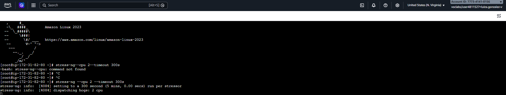

2. Observación del escalamiento

El Auto Scaling Group pasó de capacidad deseada 2 a 3 tras superar el umbral de CPU configurado.

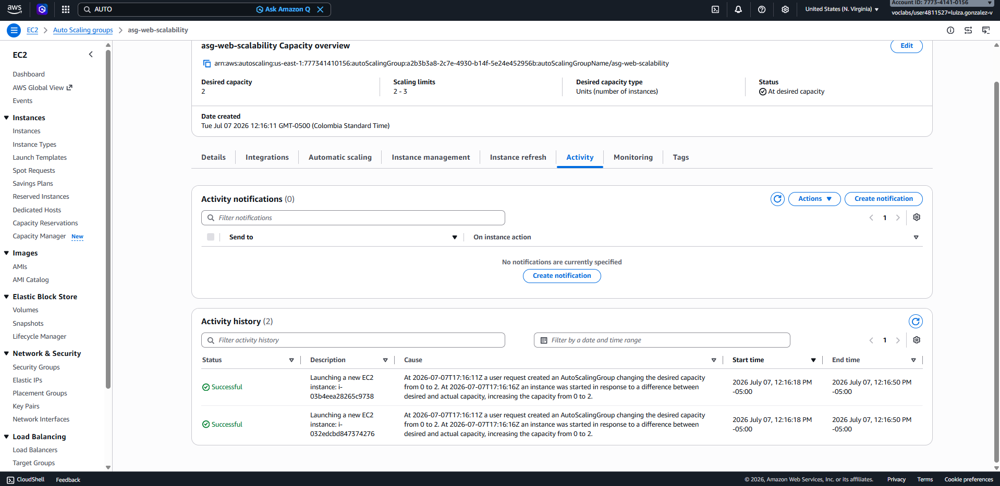
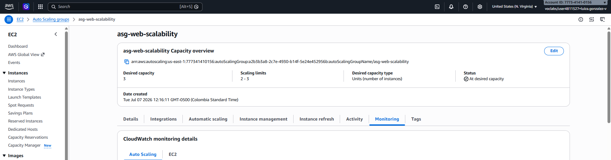

### Actividad 2: análisis del escalamiento

| Pregunta | Respuesta |
|---|---|
| Métrica que activó la política | Average CPU Utilization |
| Instancias antes de la prueba | 2 |
| Instancias después de la prueba | 3 |
| Tiempo de reacción | Algunos minutos, ya que CloudWatch recolecta métricas por intervalos antes de que Auto Scaling tome la decisión |
| Limitación de usar solo CPU | Una aplicación puede estar saturada por I/O, memoria o latencia de red sin que la CPU se eleve, dejando el sistema sin escalar aunque esté degradado |
| Otra métrica útil para una app web | `RequestCountPerTarget` o `TargetResponseTime`, que reflejan mejor la carga real percibida por el usuario |

## Observabilidad con CloudWatch

1. Métricas del Load Balancer

* RequestCount
* HealthyHostCount
* UnHealthyHostCount
* TargetResponseTime
* HTTPCode_Target_2XX_Count
* HTTPCode_Target_5XX_Count

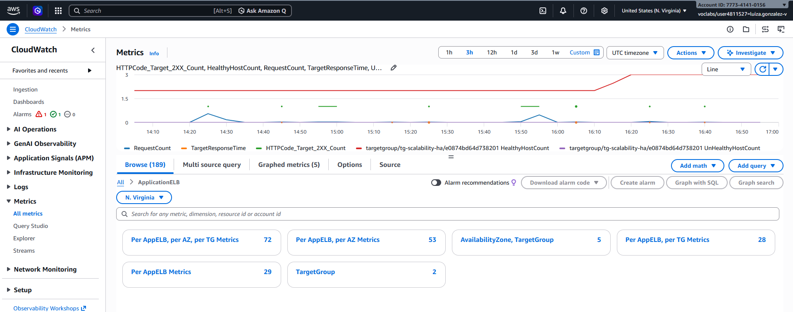

2. Auto Scaling

Group desired capacity
Group in service instances
Group total instances
Average CPU utilization

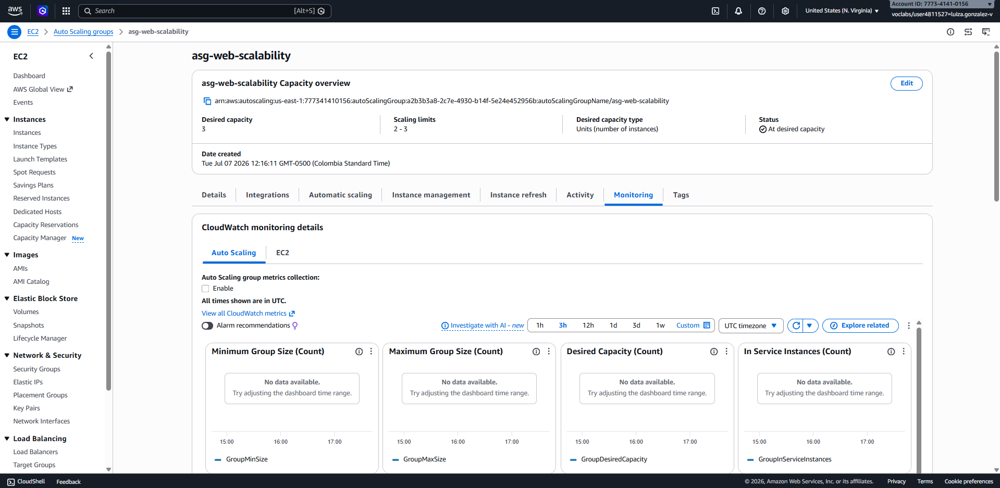

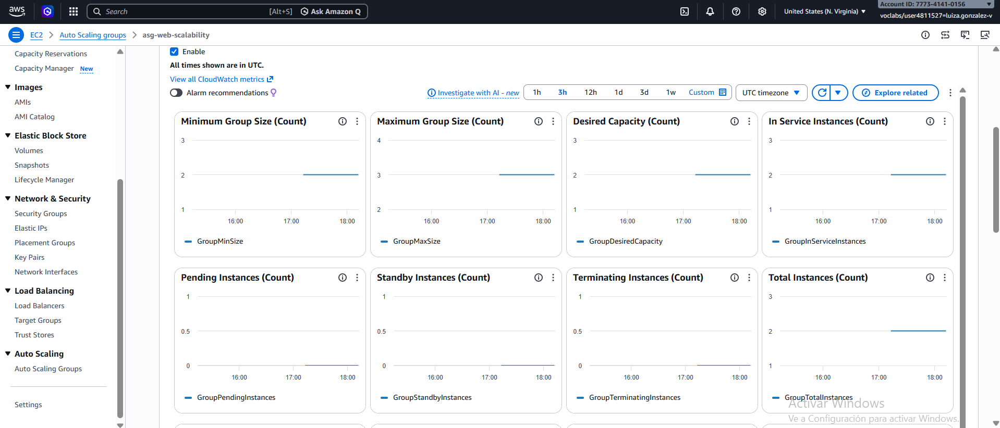

3. Instancia

CPUUtilization
NetworkIn
NetworkOut
StatusCheckFailed

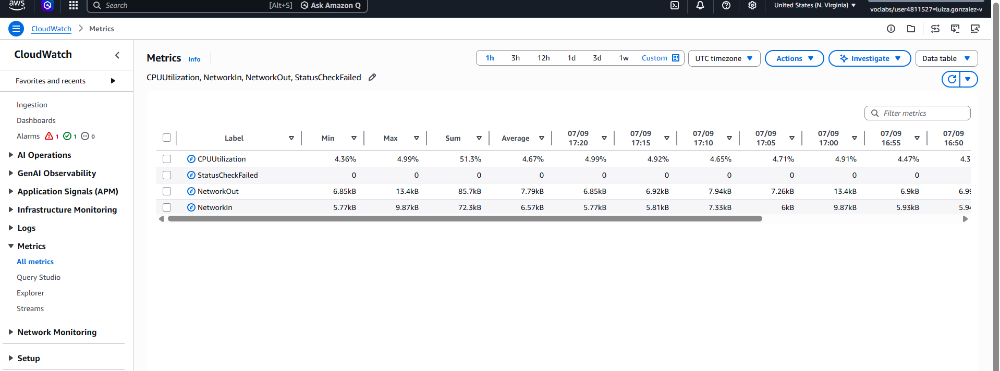

4. Análisis de observabilidad

**Métrica observada:** CPUUtilization
**Servicio AWS:** Amazon EC2 (instancias del Auto Scaling Group)
**Valor antes de la carga:** 0%
**Valor durante la carga:** *(no se logró capturar sobre las instancias correctas del ASG — la consulta se hizo sobre la instancia base, ya fuera de servicio)*
**Valor después de la carga:** 0%
**Interpretación:** No se obtuvo lectura numérica válida porque la métrica se consultó sobre `web-scalability-base` en lugar de las instancias activas del grupo. Aun así, el escalamiento observado en `GroupDesiredCapacity` confirma que la política basada en CPU sí se disparó.
**Decisión arquitectónica que soporta:** Justifica el uso de una política de Target Tracking basada en CPU para el Auto Scaling Group.

---

**Métrica observada:** HealthyHostCount
**Servicio AWS:** Elastic Load Balancing (Target Group)
**Valor antes de la carga:** 2
**Valor durante la carga:** 2
**Valor después de la carga:** 3
**Interpretación:** El Target Group mantuvo 2 hosts saludables durante ambas rondas de carga y pasó a 3 una vez el Auto Scaling Group registró la nueva instancia y esta superó el health check.
**Decisión arquitectónica que soporta:** Valida la configuración del health check en la ruta `/health` como mecanismo de protección del balanceador antes de enviar tráfico a nuevas instancias.

---

**Métrica observada:** RequestCount
**Servicio AWS:** Elastic Load Balancing (Application Load Balancer)
**Valor antes de la carga:** ~0
**Valor durante la carga:** ~1
**Valor después de la carga:** ~0
**Interpretación:** El volumen de solicitudes aumentó en ambos picos de la prueba de carga, coincidiendo con el aumento de CPU reportado por el Auto Scaling Group.
**Decisión arquitectónica que soporta:** Confirma que el ALB distribuye efectivamente el tráfico entrante hacia las instancias registradas.

---

**Métrica observada:** TargetResponseTime
**Servicio AWS:** Elastic Load Balancing (Application Load Balancer)
**Valor antes de la carga:** ~0s
**Valor durante la carga:** ~0s (sin variación visible)
**Valor después de la carga:** ~0s
**Interpretación:** El tiempo de respuesta se mantuvo estable incluso durante la carga, sin degradación perceptible.
**Decisión arquitectónica que soporta:** Sustenta que la arquitectura distribuyó correctamente la carga sin generar cuellos de botella perceptibles en esta prueba.

---

**Métrica observada:** GroupDesiredCapacity
**Servicio AWS:** Amazon EC2 Auto Scaling
**Valor antes de la carga:** 2
**Valor durante la carga:** 3
**Valor después de la carga:** 2
**Interpretación:** El Auto Scaling Group incrementó su capacidad deseada al superar el umbral de CPU objetivo, y la redujo nuevamente al normalizarse la carga.
**Decisión arquitectónica que soporta:** Evidencia el funcionamiento de la política de target tracking, ajustando la capacidad automáticamente según la demanda.

### Prueba de alta disponibilidad

1. Simulación de falla y validación de continuidad

2. Actividad 4: análisis de alta disponibilidad

* ¿Qué ocurrió cuando se detuvo una instancia?

El Target Group dejó de considerarla saludable tras fallar el health 
check, y el balanceador dejó de enviarle tráfico.

* ¿El Load Balancer siguió respondiendo?

Sí, siguió respondiendo usando las instancias restantes
marcada(s) como Healthy.

* ¿El Target Group detectó la falla?

Sí, tras el número de chequeos "unhealthy threshold" configurados 
(2 intentos con intervalo de 15 segundos).

* ¿El Auto Scaling Group lanzó una nueva instancia?

Sí, para restaurar la capacidad deseada del grupo.

* ¿Qué diferencia existe entre ocultar una falla y recuperarse de una falla?

Ocultar una falla es simplemente dejar de enviar tráfico a la instancia 
dañada mientras el sistema opera con menos capacidad 
(lo que hace el Target Group). Recuperarse de una falla 
implica además reemplazar el recurso perdido para restaurar la 
capacidad original (lo que hace el Auto Scaling Group).

* ¿Qué atributo de calidad se evidencia en esta prueba?

Disponibilidad

4. Relación entre los tres conceptos

| Concepto | Componente AWS relacionado | Evidencia en el laboratorio |
|---|---|---|
| Escalabilidad | Auto Scaling Group | Aumento de 2 a 3 instancias tras la prueba de carga (`activity.png`) |
| Alta disponibilidad | ALB + múltiples AZ | Respuestas continuas desde el DNS del balanceador durante la falla simulada |
| Observabilidad | CloudWatch Metrics | Métricas de CPU y RequestCount (`Monitoring3.png`, `RequestCount.png`) |
| Detección de fallos | Health checks | Estado *Healthy/Unhealthy* en el Target Group (`targetGroup.png`, `pruebaHealthy.png`) |
| Recuperación | Auto Scaling Group | Reemplazo automático de instancia caída |
| Distribución de carga | Load Balancer | Respuestas desde distintos `Instance ID`|

5. Propuesta de mejora para producción

- Habilitar **HTTPS** en el listener del ALB usando un certificado de AWS Certificate Manager.
- Colocar las instancias EC2 en **subredes privadas**, accesibles únicamente desde el ALB.
- Reemplazar la política basada solo en CPU por una basada en **RequestCountPerTarget**.
- Configurar **CloudWatch Alarms** con notificaciones (SNS) ante degradación de targets o errores 5XX.
- Centralizar **logs de acceso** del ALB y logs de aplicación.
- Usar una base de datos administrada **Multi-AZ** si la aplicación requiere persistencia.
- Adoptar **infraestructura como código** (Terraform/CloudFormation) para reproducibilidad del entorno.
- Aplicar despliegues **blue/green** para actualizar la aplicación sin downtime.

6. Diagrama de arquitectura.

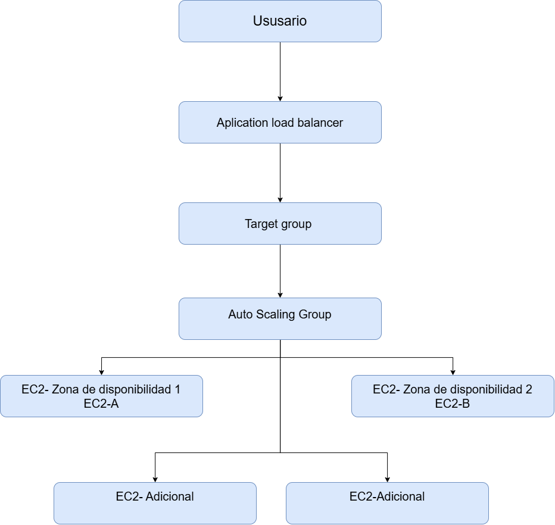

7. Limpieza de recursos

Al finalizar el laboratorio se eliminaron, en orden: Auto Scaling Group → 
Application Load Balancer → Target Group → Launch Template → 
AMI y snapshot asociado → instancia base (si aún existía) → 
Security Groups creados, para evitar consumo innecesario de créditos.